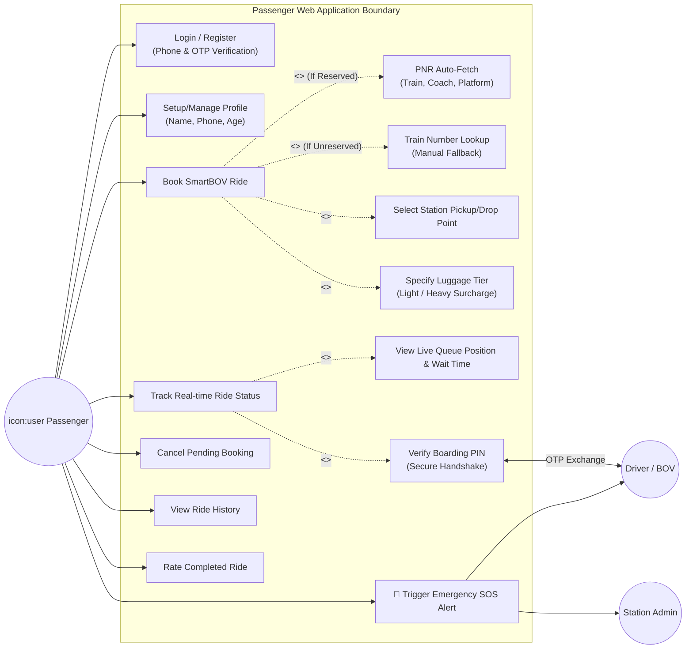

# 📊 Passenger App - Use Case Diagram & Specification

This document presents a comprehensive **Use Case Diagram** and detailed specifications for the Passenger web portal of the **Ride Reserve - SmartBOV Platform**.

## 🖼️ Visual Use Case Diagram

---

## 🗺️ Use Case Diagram (Mermaid)

The diagram below represents the interaction between the **Passenger** (Primary Actor), the **Station Staff/Driver** (Secondary Actor), the **Admin** (Secondary Actor), and the various systems within the Passenger Portal boundary.

---

## 📝 Use Case Specifications

### 1. Account Lifecycle
* **Login / Register:**
  * **Actor:** Passenger.
  * **Flow:** Passenger inputs phone number -> receives mock/production OTP -> verifies OTP -> enters system.
  * **Post-condition:** A JSON Web Token (JWT) is assigned for secure session validation.
* **Setup/Manage Profile:**
  * **Actor:** Passenger.
  * **Flow:** Input details such as Name, Phone, and Age.
  * **Business Rule:** Age parameter triggers the priority passenger criteria if they are classified as elderly or PwD (Persons with Disabilities).

---

### 2. The Booking Engine (Core Flow)
* **Book SmartBOV Ride:**
  * **Actor:** Passenger.
  * **Details:** The main wizard flow that aggregates inputs for a BOV seat allocation.
* **PNR Auto-Fetch (Optional):**
  * **Actor:** Passenger.
  * **Flow:** When selecting "Arrival" or "Departure with Reservation", the user inputs a 10-digit PNR. The local database automatically resolves and matches the coach, platform, and train details.
* **Train Number Lookup (Fallback):**
  * **Actor:** Passenger.
  * **Flow:** If booking without a reservation, the user enters the Train Number. The local timetable database matches the train, letting the user manually select their station pickup point.
* **Specify Luggage Tier:**
  * **Actor:** Passenger.
  * **Flow:** User selects luggage quantity/weight category (`None`, `Light`, or `Heavy`). Heavy luggage automatically triggers a secure backend surcharge (+₹10).

---

### 3. Queue & Ride Security Handshake
* **View Live Queue Position & Wait Time:**
  * **Actor:** Passenger.
  * **Details:** As soon as a booking is confirmed as `pending`, the database calculates active buggies on duty and pending queues. The passenger gets continuous live feedback on their estimated arrival time.
* **Verify Boarding PIN:**
  * **Actor:** Passenger & Driver.
  * **Security Rule:** Prevents drivers from misallocating seats. The passenger displays their unique 4-digit `startPin`. The driver must physically input this PIN on their device to change the booking status to `in-progress`.
* **Cancel Pending Booking:**
  * **Actor:** Passenger.
  * **Rule:** A passenger can cancel a booking, but only if its status is still `pending` or `confirmed` (before boarding starts).

---

### 4. Safety & Feedback
* **🚨 Trigger Emergency SOS Alert:**
  * **Actor:** Passenger.
  * **Details:** Available throughout the active ride. When pressed, it broadcasts coordinates instantly over Socket.io, lighting up the admin dashboards with visual and audio SOS alarms.
* **Rate Completed Ride:**
  * **Actor:** Passenger.
  * **Details:** Allows passenger to leave rating scores for the driver to maintain quality control.
