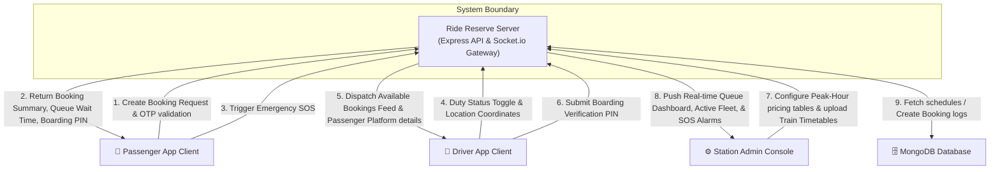
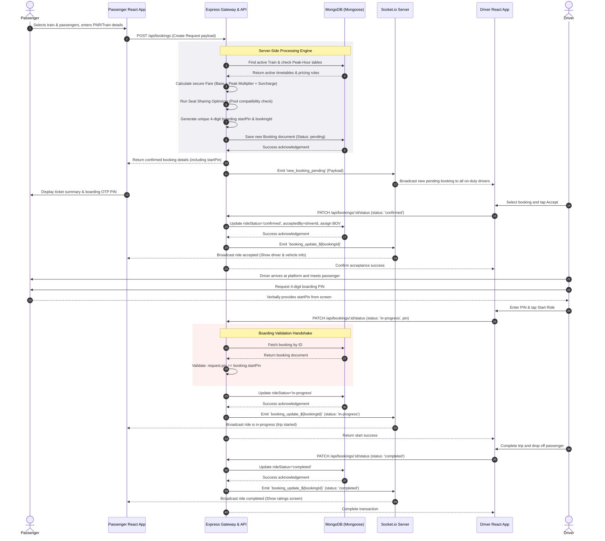
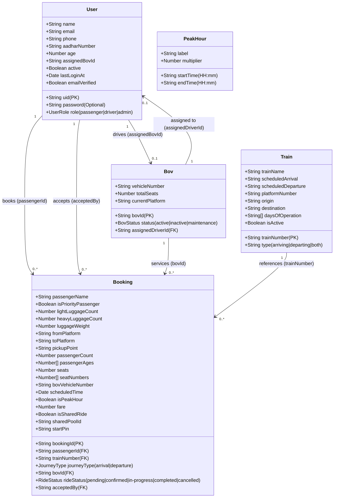

# 📐 Ride Reserve - Platform System Architecture Models

This document outlines the **Context**, **Interaction**, **Behavioral**, and **Structural** design models of the **Ride Reserve - SmartBOV Platform** to establish a textbook-grade professional software architecture blueprint.

---

## 1. 🌐 Context Model (DFD Level 0)

The system context diagram illustrates the high-level boundary of the **Ride Reserve System** and its interaction with the surrounding external entities (Passenger, Driver, Station Admin, and Database), detailing the flow of input and output data.

### 🖼️ Visual Context Model Preview




---

## 2. 🔄 Interaction Model: Sequence of Events

The sequence diagram below describes the real-time interaction flow of creating a booking, matching a driver, executing the secure boarding PIN handshake, and completing the trip.

### 🖼️ Visual Sequence Diagram Preview




---

## 3. 🚦 Behavioral Model: Booking State Machine

This state chart outlines the lifecycle states of a Booking document, showcasing valid state transitions, triggers, and guards (such as PIN verification).

### 🖼️ Visual State Machine Preview


```mermaid
stateDiagram-v2
    [*] --> Pending : Passenger submits booking request (POST /api/bookings)
    
    state Pending {
        [*] --> Unpooled : No compatible concurrent booking found
        [*] --> Pooled : Grouped with compatible ride (seats sum <= 4)
    }

    Pending --> Cancelled : Passenger cancels ride (status='cancelled')
    Pending --> Confirmed : Driver accepts ride (status='confirmed')
    
    state Confirmed {
        Note right of Confirmed: Driver & BOV allocated, boarding PIN generated
    }

    Confirmed --> Cancelled : Passenger or Admin cancels ride
    
    Confirmed --> InProgress : Driver verifies 4-digit PIN (PATCH status='in-progress', pin == startPin)
    
    state InProgress {
        Note right of InProgress: Active ride, Emergency SOS trigger active
    }

    InProgress --> Completed : Driver drops passenger at destination (status='completed')
    
    Completed --> [*]
    Cancelled --> [*]
```

---

## 🗄️ 4. Structural Model: Mongoose Database Schemas (UML Class Diagram)

This class diagram represents the logical structural schemas in MongoDB modeled via Mongoose, illustrating their properties, data types, and collection associations.

### 🖼️ Visual Class Diagram Preview



