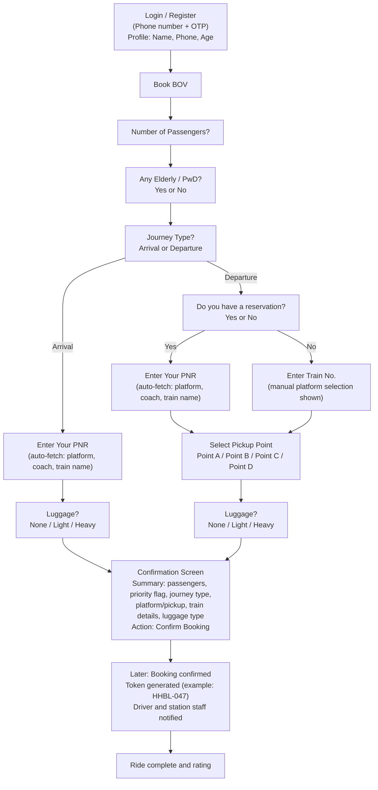

# Passenger BOV Booking Flow (Passenger POV)

Source references:
- `C:\Users\Shubhang R\Downloads\Passenger.png`
- `C:\Users\Shubhang R\Downloads\BOV_Booking_System_Requirements.md`

## Flowchart (as shown in Passenger.png)

## Screen-level input map

1. Login/Register: `phoneOtp`, `name`, `age`
2. Trip basics: `passengerCount`, `isPriorityPassenger`, `journeyType`
3. Arrival path: `pnr`, `luggageType`
4. Departure path:
   - Reservation yes: `pnr`, `pickupPoint`, `luggageType`
   - Reservation no: `trainNumber`, `pickupPoint`, `luggageType`
5. Confirmation: all fields + fetched train metadata + final submit

## Alignment note with requirements doc

The requirements file currently defines primary lookup by `trainNumber`.  
This passenger flow introduces a PNR-first option for reserved passengers.  
Recommended unified rule:

1. If PNR is available, fetch train and coach details from PNR first.
2. If PNR is unavailable, fallback to train number + manual platform/pickup selection.
3. Persist both `lookupType` (`pnr` or `trainNumber`) and normalized train/platform fields in booking data.
